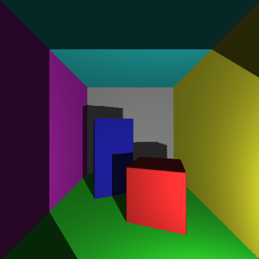

# Ray Tracer

Ray Tracer for the University of Bristol Computer Graphics course (course work 1).

## How to Build

Simply use the [Makefile](Makefile) to build the program by running the following command in the directory.

```
make
```

A rendered image of the [Cornell Box](https://en.wikipedia.org/wiki/Cornell_box) should appear.
Note: SDL should be installed on the machine.

## Latest Rendered Image



## Overview

To generate an image we trace rays of light from a light source back to the camera. We need to simulate the behaviour of the light rays and how they interact with geometry in the scene.

This is an implementation of a Ray Tracer displaying a render of the [Cornell Box](https://en.wikipedia.org/wiki/Cornell_box). The program is split up into the following steps:

- Represent 3D scenes using triangular surfaces.
- Trace the ray of each pixel in the camera image into the scene.
- Compute ray-triangle intersections, to find out which surface a ray hit.

## Possible Extensions

- Add fog? By increasing the power in that big equation in the exponent
- Download a material from the MERL database and add it to the scene?


## Technologies

Uses the following technologies:

- [SDL](http://www.libsdl.org)
- [GLM](http://glm.g-truc.net)
